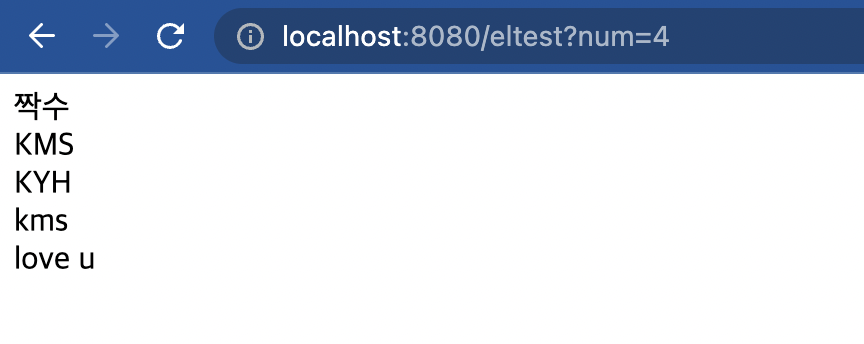

# Model2 방식?

model1방식에서는 그냥 코드를 몰아넣어 보기가 불편하다는 것이 있었다.

model2방식은 컨트롤러와 view를 물리적으로 분리한다.

저번에 작성한 model1방식의 코드는 다음과 같이 수정할 수 있다.


## Controller

```java
package example.model2controller;

import jakarta.servlet.RequestDispatcher;
import jakarta.servlet.ServletException;
import jakarta.servlet.annotation.WebServlet;
import jakarta.servlet.http.HttpServlet;
import jakarta.servlet.http.HttpServletRequest;
import jakarta.servlet.http.HttpServletResponse;

import java.io.IOException;

@WebServlet("/model2")
public class model2test extends HttpServlet {
    @Override
    protected void doGet(HttpServletRequest request, HttpServletResponse response) throws ServletException, IOException {
        int num = 0;
        String getnum = request.getParameter("num");
        if(getnum != null && !getnum.equals("")){
            num = Integer.parseInt(getnum);
        }

        String result = "";
        if(num %2 ==1){
            result = "홀수";
        }else{
            result = "짝수";
        }

        request.setAttribute("request",result);

        //foward
        //url 연결
        RequestDispatcher requestDispatcher = request.getRequestDispatcher("/model2.jsp");
        requestDispatcher.forward(request,response);

    }
}

```

## View

```jsp

<%@ page contentType="text/html;charset=UTF-8" language="java" %>
<html>
<head>
    <title>model_2 Test</title>
</head>
<body>
    <%=request.getAttribute("request") %>입니다.
</body>
</html>

```

Dispatcher가 한 번에 컨트롤러를 관리할 수 있게 도와주고, 물리적으로 코드를 분리하여 더 가독성이 뛰어나졌다.

하지만 아직도 jsp에는 java코드가 남아있다.


-----

# EL 표기법

위에서는 귀찮게 저장소에 셋팅하고 그걸 꺼내서 썼다. EL은 좀 더 편하게 해준다.

## Controller

```java
package example.ELtest;

import jakarta.servlet.RequestDispatcher;
import jakarta.servlet.ServletException;
import jakarta.servlet.annotation.WebServlet;
import jakarta.servlet.http.HttpServlet;
import jakarta.servlet.http.HttpServletRequest;
import jakarta.servlet.http.HttpServletResponse;

import java.io.IOException;
import java.util.HashMap;
import java.util.Map;

@WebServlet("/eltest")
public class elcontroller extends HttpServlet {
    @Override
    protected void doGet(HttpServletRequest request, HttpServletResponse response) throws ServletException, IOException {
        int num = 0;
        String getnum = request.getParameter("num");
        if(getnum != null && !getnum.equals("")){
            num = Integer.parseInt(getnum);
        }

        String result = "";
        if(num %2 ==1){
            result = "홀수";
        }else{
            result = "짝수";
        }

        request.setAttribute("request",result);
        //리스트 담기
        String[] names = {"KMS","KYH"};
        request.setAttribute("names",names);

        //Map담기
        Map<String, String> map = new HashMap<String,String>();
        map.put("title","kms");
        map.put("content","love u");
        request.setAttribute("mapdata",map);

        //foward
        //url 연결
        RequestDispatcher requestDispatcher = request.getRequestDispatcher("/EL.jsp");
        requestDispatcher.forward(request,response);

    }
}

```

## View(jsp file)

```jsp
<%@ page contentType="text/html;charset=UTF-8" language="java" %>
<html>
<head>
    <title>EL test</title>
</head>
<body>
${request} <br>
${names[0]} <br>
${names[1]} <br>
${mapdata.title} <br>
${mapdata.content} <br>
</body>
</html>

```

  

-----  

# EL의 저장소

이 놈들 어디에 저장되고 찾아오는걸까?

크게 4가지다.

Page -> Request -> Session -> Application  순으로 찾는다.

특정하게 지정하여 찾을 수도 있다.

아쉽게도 이클립스에서만 지원한 것 같다.

```jsp
${requestScope.request} // request는 사용자가 지정한 값. 
```

이런 식으로 범위를 지정하여 값들을 찾을 수 있다.


